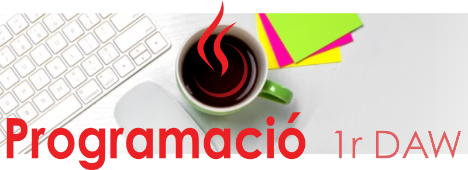

# módulo de Programación (PR)

    

## Índice de unidades

| unidad |                                                      |
| ------ | ---------------------------------------------------- |
| UD 00  | Conocimientos previos                                |
| UD 01  | Elementos de un programa informático                 |
| UD 02  | Utilización de objetos y clases                      |
| UD 03  | Estructuras de control y excepciones                 |
| UD 04  | Estructuras de datos Arrays y matrices. Recursividad |
| UD 05  | Desarrollo de clases                                 |
| UD 06  | Lectura y escritura de información                   |
| UD 07  | Colecciones                                          |
| UD 08  | Composición, Herencia y Polimorfismo                 |
| UD 09  | Acceso a bases de datos                              |
| UD 10  | Interfaz gráfica                                     |

!!!note "Licencia"
	 
	Este material está bajo una Licencia **Creative Commons** Atribución-Compartir-Igual 4.0 Internacional. 
	*Derivado a partir de material de David Martínez Peña (https://github.com/martinezpenya).*

